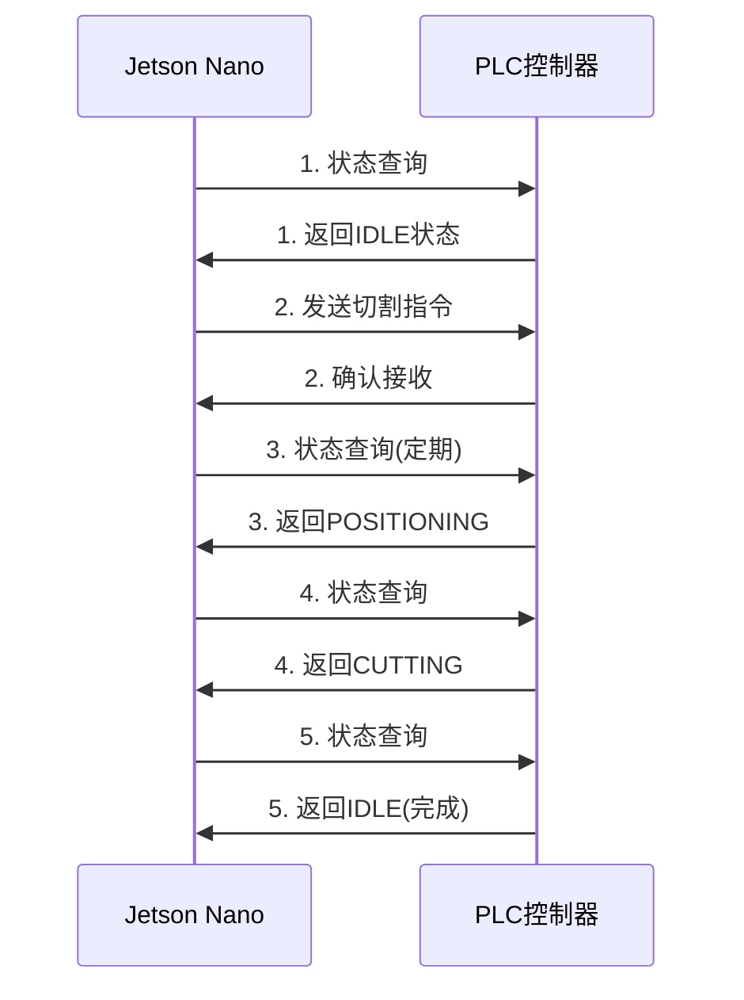
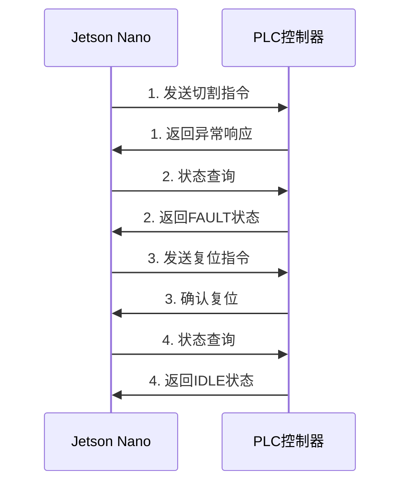

# 智能切竹机通信协议详细规范

## 协议概述

智能切竹机采用**Modbus TCP**作为主要通信协议，实现Jetson Nano AI视觉系统与PLC控制器之间的实时数据交换。协议设计注重安全性、实时性和可靠性。

### 通信架构
```
┌─────────────────┐    Modbus TCP    ┌─────────────────┐
│  Jetson Nano    │◄─────────────────►│  PLC控制器      │
│  (AI视觉处理)   │   Ethernet LAN   │  (设备控制)     │
│  IP: 192.168.1.10│                  │  IP: 192.168.1.20│
└─────────────────┘                  └─────────────────┘
```

---

## 报文结构设计

### 基础Modbus TCP头部
```
字节偏移  |  字段名称     |  长度   |  说明
---------|--------------|---------|------------------
0-1      |  事务标识符   |  2字节  |  区分不同请求
2-3      |  协议标识符   |  2字节  |  固定为0x0000
4-5      |  长度字段     |  2字节  |  后续字节数
6        |  单元标识符   |  1字节  |  设备地址
```

### 扩展安全头部
```
字节偏移  |  字段名称     |  长度   |  说明
---------|--------------|---------|------------------
7-10     |  序列号       |  4字节  |  防重放攻击
11-18    |  时间戳       |  8字节  |  IEEE 1588格式
19-22    |  CRC32校验    |  4字节  |  数据完整性
23-54    |  数字签名     |  32字节 |  ECDSA P-256
```

---

## 命令报文定义

### 1. 切割指令 (Function Code: 0x10)

#### 发送格式 (CuttingCommand)
```
┌──────────────────────────────────────────────────────────┐
│  Modbus TCP Header + 扩展安全头部 (55字节)                │
├──────────────────────────────────────────────────────────┤
│  功能码: 0x10 (写多个保持寄存器)           │  1字节      │
│  起始地址: 0x1000                         │  2字节      │
│  寄存器数量: 0x0008                       │  2字节      │
│  字节数: 0x10                             │  1字节      │
├──────────────────────────────────────────────────────────┤
│  目标位置 (target_position)               │  4字节 Float│
│  切割速度 (cutting_speed)                 │  4字节 Float│
│  刀具选择 (tool_id)                       │  4字节 UInt │
│  保留字段                                 │  4字节      │
└──────────────────────────────────────────────────────────┘
```

#### 参数详细说明
- **target_position**: 切割目标位置，单位mm，精度0.01mm
  - 范围: 0.00 ~ 1000.00mm
  - 数据类型: IEEE 754 单精度浮点数
- **cutting_speed**: 切割速度，单位mm/s
  - 范围: 0.1 ~ 100.0mm/s
  - 数据类型: IEEE 754 单精度浮点数
- **tool_id**: 刀具选择标识
  - 0x00000000: 主刀具
  - 0x00000001: 备用刀具
  - 其他值: 保留

### 2. 状态查询 (Function Code: 0x03)

#### 发送格式
```
┌──────────────────────────────────────────────────────────┐
│  Modbus TCP Header + 扩展安全头部 (55字节)                │
├──────────────────────────────────────────────────────────┤
│  功能码: 0x03 (读保持寄存器)               │  1字节      │
│  起始地址: 0x2000                         │  2字节      │
│  寄存器数量: 0x0010                       │  2字节      │
└──────────────────────────────────────────────────────────┘
```

---

## 响应报文定义

### 1. 设备状态响应 (DeviceStatus)

#### 返回格式
```
┌──────────────────────────────────────────────────────────┐
│  Modbus TCP Header (7字节)                               │
├──────────────────────────────────────────────────────────┤
│  功能码: 0x03                             │  1字节      │
│  字节数: 0x20                             │  1字节      │
├──────────────────────────────────────────────────────────┤
│  设备状态 (current_state)                 │  4字节 UInt │
│  实际位置 (actual_position)               │  4字节 Float│
│  位置误差 (position_error)                │  4字节 Float│
│  切割力 (cutting_force)                   │  4字节 Float│
│  电机温度 (motor_temp)                    │  4字节 Float│
│  急停状态 (emergency_stop)                │  4字节 UInt │
│  扩展状态1                                │  4字节      │
│  扩展状态2                                │  4字节      │
└──────────────────────────────────────────────────────────┘
```

#### 状态字段详细定义

##### 设备状态 (current_state)
```
位域   |  状态名称     |  说明
-------|--------------|------------------
0-7    |  主状态       |  0:空闲 1:定位中 2:切割中 3:故障
8-15   |  子状态       |  详细运行状态
16-23  |  安全状态     |  安全系统状态
24-31  |  扩展状态     |  保留扩展
```

##### 主状态编码
- `0x00`: IDLE - 设备空闲，等待指令
- `0x01`: POSITIONING - 正在执行定位动作
- `0x02`: CUTTING - 正在执行切割动作
- `0x03`: FAULT - 设备故障状态

##### 故障代码 (当主状态为FAULT时)
```
错误码  |  故障类型     |  说明
-------|--------------|------------------
0x0301 |  位置超限     |  移动超出安全范围
0x0302 |  切割力过载   |  切割阻力异常
0x0303 |  电机过热     |  电机温度超标
0x0304 |  通信超时     |  视觉系统通信中断
0x0305 |  急停触发     |  安全急停被激活
0x0306 |  刀具故障     |  切割刀具异常
```

---

## 寄存器地址映射

### 控制寄存器 (可写)
```
地址范围    |  功能描述        |  数据类型  |  访问权限
-----------|-----------------|----------|----------
0x1000-1001| 目标位置         |  Float   |  读写
0x1002-1003| 切割速度         |  Float   |  读写
0x1004     | 刀具选择         |  UInt16  |  读写
0x1005     | 控制命令         |  UInt16  |  读写
0x1006-1007| 保留             |  -       |  保留
0x1008-100F| 扩展参数         |  Mixed   |  读写
```

### 状态寄存器 (只读)
```
地址范围    |  功能描述        |  数据类型  |  访问权限
-----------|-----------------|----------|----------
0x2000     | 设备状态         |  UInt32  |  只读
0x2001-2002| 实际位置         |  Float   |  只读
0x2003-2004| 位置误差         |  Float   |  只读
0x2005-2006| 切割力           |  Float   |  只读
0x2007-2008| 电机温度         |  Float   |  只读
0x2009     | 急停状态         |  UInt16  |  只读
0x200A-200F| 传感器数据       |  Mixed   |  只读
```

---

## 安全机制

### 1. 数字签名验证
```python
# ECDSA P-256签名验证流程
def verify_signature(message, signature, public_key):
    """
    验证报文数字签名
    message: 除签名外的完整报文
    signature: 32字节ECDSA签名
    public_key: 设备公钥
    """
    hash_obj = hashlib.sha256(message)
    return ecdsa.verify(signature, hash_obj.digest(), public_key)
```

### 2. CRC32校验
```python
# CRC32校验算法 (多项式: 0xEDB88320)
def calculate_crc32(data):
    """计算CRC32校验值"""
    crc = 0xFFFFFFFF
    for byte in data:
        crc ^= byte
        for _ in range(8):
            if crc & 1:
                crc = (crc >> 1) ^ 0xEDB88320
            else:
                crc >>= 1
    return crc ^ 0xFFFFFFFF
```

### 3. 时间戳验证
```python
# IEEE 1588时间戳格式
def validate_timestamp(timestamp):
    """验证时间戳有效性"""
    current_time = get_ieee1588_time()
    time_diff = abs(current_time - timestamp)
    return time_diff < MAX_TIME_DEVIATION  # 最大偏差5秒
```

---

## 通信流程

### 典型工作流程


### 异常处理流程


---

## 性能参数

### 通信性能
- **波特率**: 100Mbps (以太网)
- **响应时间**: <10ms (正常状态)
- **数据包大小**: 最大1500字节 (MTU)
- **并发连接**: 支持最多4个客户端

### 可靠性指标
- **数据传输成功率**: >99.9%
- **重传次数**: 最大3次
- **超时时间**: 500ms
- **连接保活**: 30秒心跳

---

## 配置参数

### 网络配置
```ini
[网络设置]
本地IP地址 = 192.168.1.10
子网掩码 = 255.255.255.0
默认网关 = 192.168.1.1
PLC地址 = 192.168.1.20
端口号 = 502

[安全设置]
启用数字签名 = true
启用CRC校验 = true
时间同步 = true
最大时间偏差 = 5000ms

[性能设置]
心跳间隔 = 30s
超时时间 = 500ms
重传次数 = 3
缓冲区大小 = 4096字节
```

---

## 调试与诊断

### 日志格式
```
时间戳 | 日志级别 | 模块 | 消息内容
2025-01-11 10:30:15.123 | INFO | COMM | 发送切割指令: 位置=150.00mm
2025-01-11 10:30:15.125 | INFO | COMM | 接收确认响应: OK
2025-01-11 10:30:15.223 | WARN | COMM | CRC校验失败，重传报文
2025-01-11 10:30:16.001 | ERROR| COMM | 通信超时，连接断开
```

### 诊断工具
- **数据包抓取**: Wireshark分析
- **协议测试**: 专用测试工具
- **性能监控**: 实时统计面板
- **错误分析**: 错误代码查询

---

*通信协议文档版本: v1.0*  
*最后更新: 2025-01-11*  
*下次审核: 2025-04-11* 